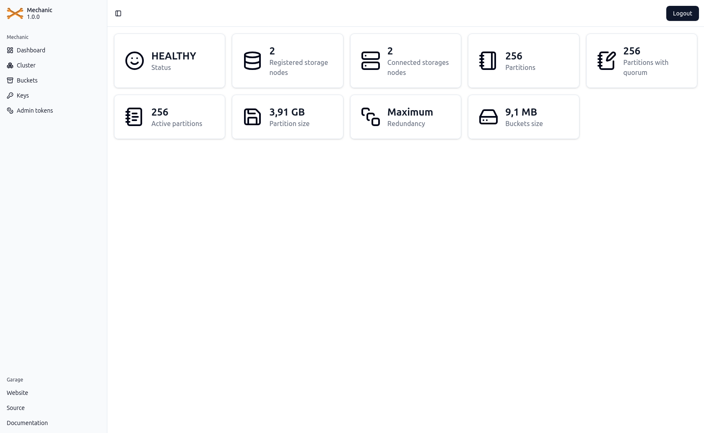
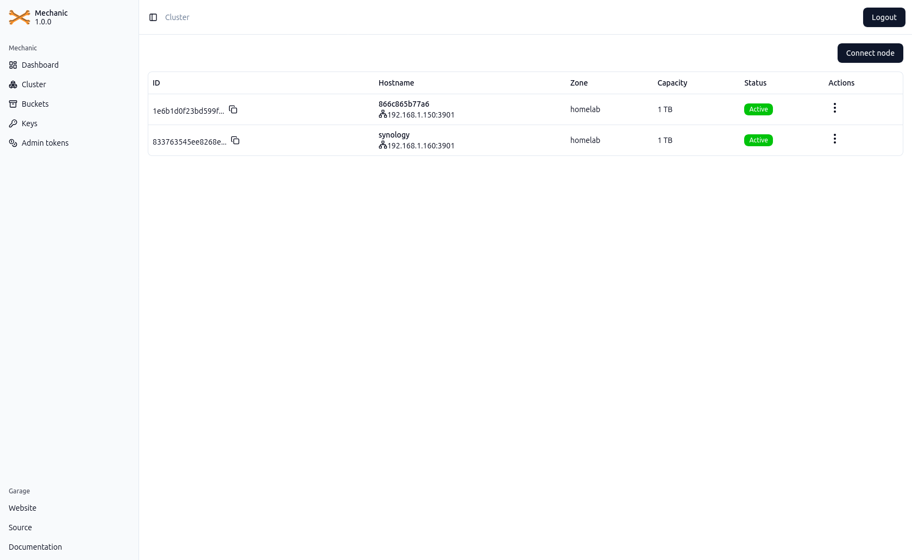
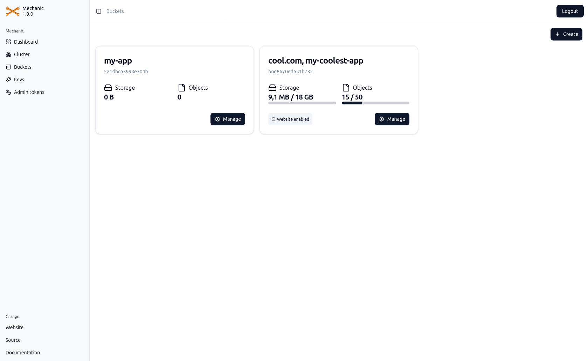
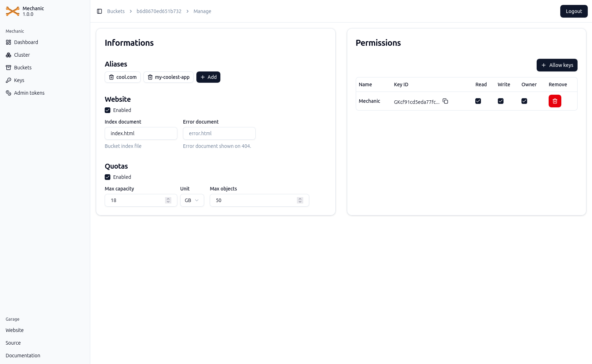
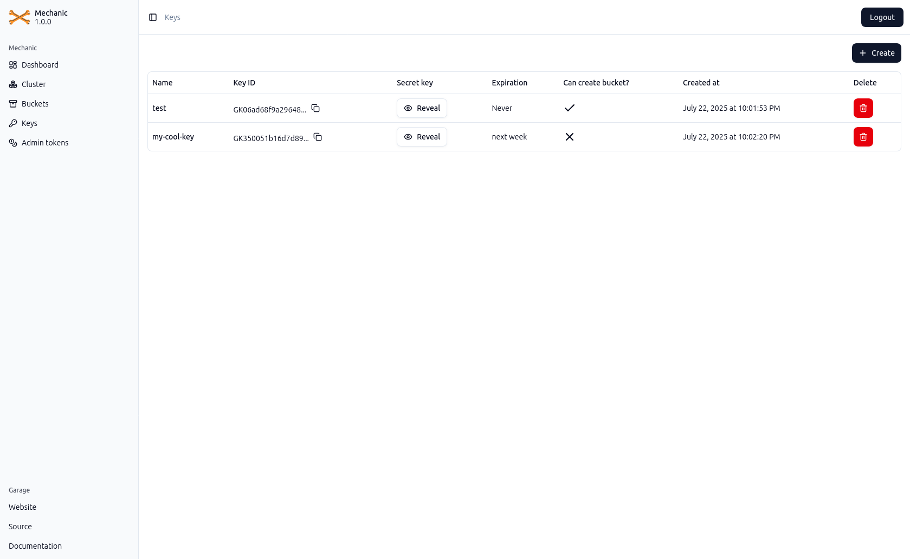
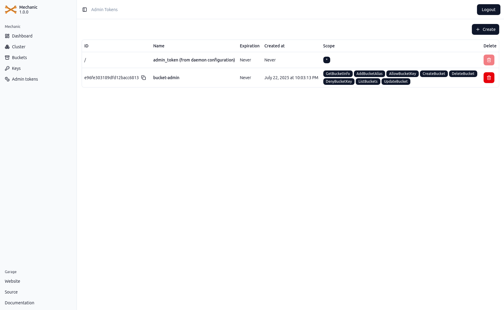

<h1 align="center">Mechanic</h1>

<div align="center">
  

</div>

<h2 align="center">
  Your Garage UI
</h2>

<div align="center">
  
  
  
</div>

<div align="center">
  <h3>
    <span> [ </span>
    <a href="https://garagehq.deuxfleurs.fr/">
      Garage
    </a>
    <span> | </span>
    <a href="https://deuxfleurs.fr/">
      Deuxfleurs
    </a>
    <span> ] </span>
  </h3>
</div>

<div align="center">
  <sub>The coolest UI for the coolest self-hosted, s3 compatible, distributed object storage service. <br />Built with 🫕 by
  <a href="https://bsky.app/profile/stouder.io">Xavier Stouder</a>.</sub>
</div>

## Table of Contents
- [Features](#features)
- [Installation](#installation)
- [Configuration](#configuration)
- [Development](#development)
- [Special thanks](#special-thanks)
## Features
- Cluster status dashboard
- Cluster and layout management
- Manage or browse buckets
- Manage website config of buckets
- Manage keys
- Manage admin tokens
- Auth using admin token

### Coming soon (hopefully)
- Introspect admin token used to enable/disables views on Mechanic
- Get rid of the backend part to host mechanic directly inside a Garage bucket

## Installation
Mechanic is available as a single JAR file and docker image.

### Docker CLI
```shell
$ docker run -e GARAGE_API_URL=http://127.0.0.1:3903 -e MECHANIC_BROWSE_ENABLE=true -e GARAGE_S3_URL=http://127.0.0.1:3900 -p 8080:8080 --restart unless-stopped --name mechanic mechanic:latest
```
### Docker Compose

### JAR file
```shell
$ java -jar mechanic.jar
```

## Configuration

Following environment variables can be set to configure Mechanic:

| Variable               | Required                                | Description                                                     |
|------------------------|-----------------------------------------|-----------------------------------------------------------------|
| GARAGE_API_URL         | Yes                                     | Garage admin api endpoint                                       |
| MECHANIC_BROWSE_ENABLE | No                                      | If `true`, Mechanic allow the user to browse buckets it can access. |
| GARAGE_S3_URL          | Only `MECHANIC_BROWSE_ENABLE` is `true` | Garage s3 endpoint                                              |

## Development
The project is fully bootstrapped using Gradle. Frontend is located in the `frontend` subfolder.

### Stack
Most stack choice was guided by what I'm already familiar with.
Backend use Spring Boot framework with Kotlin.
Frontend use React, TailwindCSS for styling and ShadCN components as UI elements.

### Architecture
The frontend currently interacts with Garage using its admin API v2, which means the frontend theoretically has all the functionality needed to run Mechanic.
However, the backend is still required to proxy requests from the frontend to Garage with proper CORS headers, since Garage doesn't allow CORS configuration.

My ultimate goal is to eliminate the Kotlin backend entirely, making Mechanic a static frontend app that could be hosted directly from a Garage bucket,
but this isn't possible until Garage adds CORS configuration support.

### Contributing
Contributions are welcome =)

## Special thanks
- [khairul169](https://github.com/khairul169) for the [garage-webui](https://github.com/khairul169/garage-webui), which inspired this project.

## Screenshots
### Dashboard


### Cluster


### Buckets


### Bucket manage


### Keys


### Admin tokens
